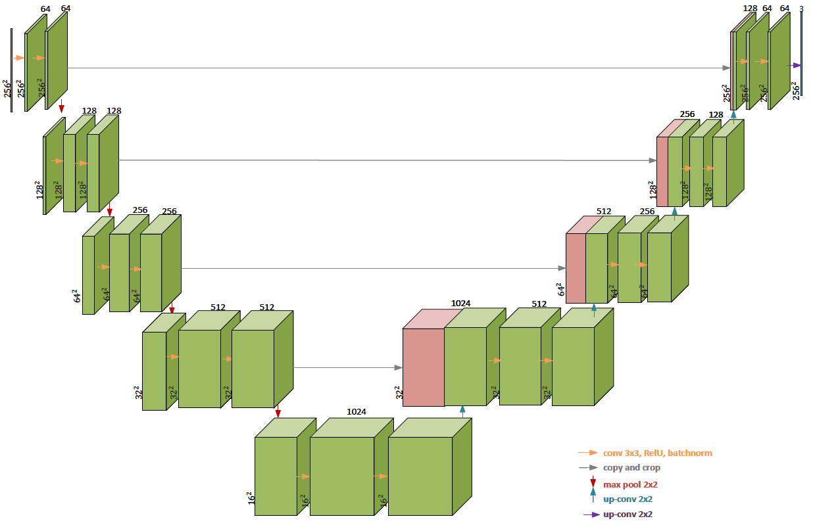
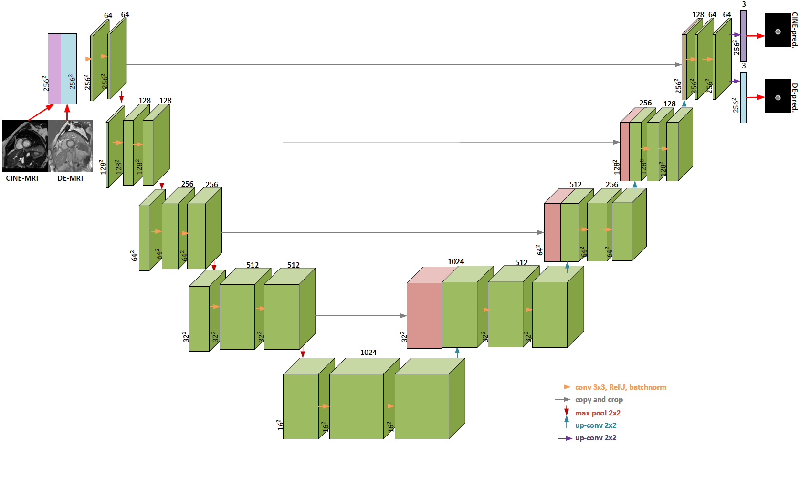
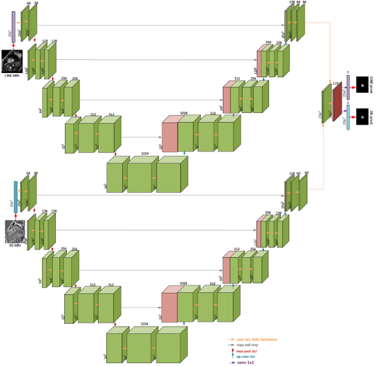
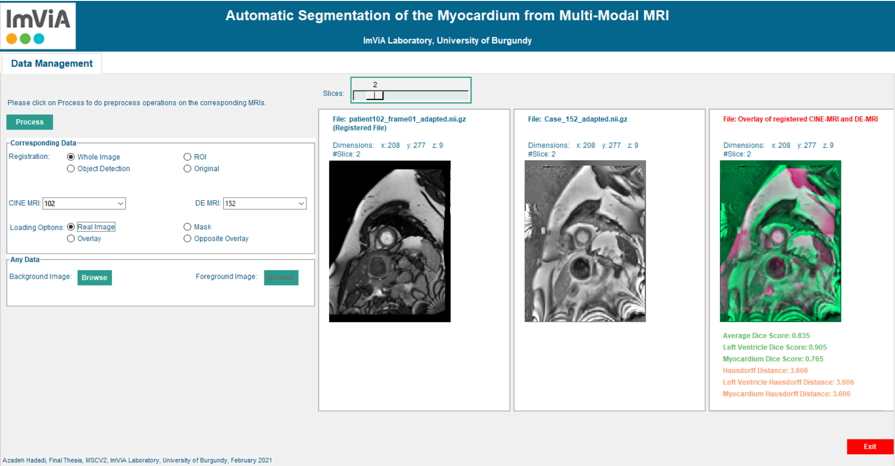

# Cardiac MRI Multi-Modal Segmentation  

Automatic segmentation of the myocardium from **Cine-MRI** and **DE-MRI** using **deep learning fusion schemes (input & output fusion with U-Net)**.  

---

## Overview  
This repository contains the implementation and results of my MSc thesis (2021), focusing on **automatic myocardium segmentation** from multi-modal MRI scans.  

- **Goal:** Improve post-MI (Myocardial Infarction) assessment by combining Cine-MRI and DE-MRI.  
- **Approach:** Deep learning (U-Net) with fusion at input and output levels.  
- **Datasets:** ACDC, Emidec, and CINEDE (in-house dataset).  

Fusion of modalities shows significant improvement over single-modality segmentation.  

---

## Key Contributions  
- Developed **fusion schemes** (input-level and output-level) for myocardium segmentation.  
- Evaluated the effect of **image registration** on segmentation precision.  
- Analyzed the impact of **cross-validation folds** on model performance.  
- Benchmarked against **ACDC** and **Emidec** challenge results.  

---

## Repository Structure  

---

## Datasets  
- **[ACDC Challenge](https://www.creatis.insa-lyon.fr/Challenge/acdc/)** (Cine-MRI)  
- **[Emidec Challenge](https://emidec.com/)** (DE-MRI)  
- **CINEDE (in-house)** – Cine + DE MRI dataset (76 exams, not publicly available).  

⚠️ Due to license restrictions, **datasets are not included**. Please request them from the official sources.  

---

## Methodology  

### Preprocessing  
- Resolution adjustment, up-sampling, padding  
- Contrast enhancement (CLAHE)  
- Super-resolution (EDSR)  
- Image registration (custom software)  

### Network Architectures  
- **Baseline U-Net** – single modality segmentation  
- **Input Fusion U-Net** – combines Cine & DE as multi-channel input  
- **Output Fusion U-Net** – independent U-Nets for each modality, then fused outputs  

Example diagrams:  
  
  
  
  

---

## Results  

| Modality            | Dice (↑) | Hausdorff Distance (↓) |
|---------------------|----------|------------------------|
| Cine-MRI            |        |                      |
| DE-MRI              |        |                      |
| Input Fusion        |        |                      |
| Output Fusion       |        |                      |

- Fusion approaches outperform single-modality segmentation.  
- Registration improves training stability and accuracy.  

Example plots:  
  
  
  

---

## Implementation  
- **Framework:** PyTorch  
- **Preprocessing:** ITK-Snap, OpenCV, PyTorch  
- **Hardware:** NVIDIA GPU (CUDA)  

---

## Future Work  
- Extend to **3D U-Net** and hybrid 2D/3D architectures  
- Integrate **clinical parameters** with imaging  
- Apply methodology to other organs (e.g., brain MRI fusion)  

---
