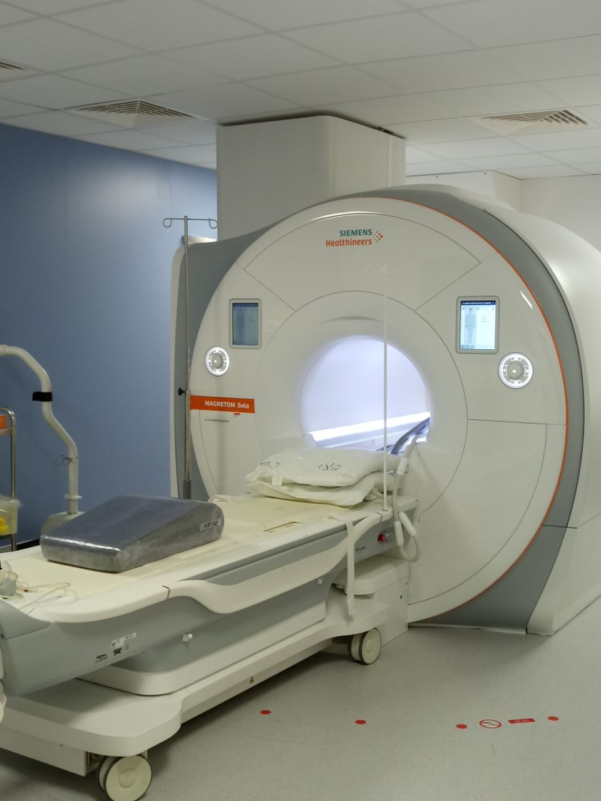

# Cardiac MRI Multi-Modal Segmentation  

Automatic segmentation of the myocardium from **Cine-MRI** and **DE-MRI** using **deep learning fusion schemes (input & output fusion with U-Net)**.  

---

## Overview  
This repository contains the implementation and results of my MSc thesis (2021), focusing on **automatic myocardium segmentation** from multi-modal MRI scans.  

- **Goal:** Improve post-MI (Myocardial Infarction) assessment by combining Cine-MRI and DE-MRI.  
- **Approach:** Deep learning (U-Net) with fusion at input and output levels.  
- **Datasets:** ACDC, Emidec, and CINEDE (in-house dataset).  

Fusion of modalities shows significant improvement over single-modality segmentation.

---

## Key Contributions  
- Developed **fusion schemes** (input-level and output-level) for myocardium segmentation.  
- Evaluated the effect of **image registration** on segmentation precision.  
- Analyzed the impact of **cross-validation folds** on model performance.  
- Benchmarked against **ACDC** and **Emidec** challenge results.  

---

## Repository Structure  

---

## Datasets  
- **[ACDC Challenge](https://www.creatis.insa-lyon.fr/Challenge/acdc/)** (Cine-MRI)  
- **[Emidec Challenge](https://emidec.com/)** (DE-MRI)  
- **CINEDE (in-house)** – Cine + DE MRI dataset (76 exams, not publicly available).  

⚠️ Due to license restrictions, **datasets are not included**. Please request them from the official sources.  

---

## Methodology  

### Preprocessing  
- Resolution adjustment, up-sampling, padding  
- Contrast enhancement (CLAHE)  
- Super-resolution (EDSR)  
- Image registration (custom software)
   

### Network Architectures  
- **Baseline U-Net** – single modality segmentation

- **Input Fusion U-Net** – combines Cine & DE as multi-channel input

- **Output Fusion U-Net** – independent U-Nets for each modality, then fused outputs
 

---

## Results  

<table>
  <thead>
    <tr>
      <th rowspan="2">Modality</th>
      <th colspan="4">Dice (↑)</th>
      <th colspan="4">Hausdorff Distance (↓)</th>
      <th rowspan="2">Average Loss</th>
    </tr>
    <tr>
      <th>CV</th>
      <th>MYO</th>
      <th>Mean</th>
      <th>STD</th>
      <th>CV</th>
      <th>MYO</th>
      <th>Mean</th>
      <th>STD</th>
    </tr>
  </thead>
  <tbody>
    <tr>
      <td>Single Modality</td>
      <td>0.869</td>
      <td>0.655</td>
      <td>0.762</td>
      <td>0.136</td>
      <td>5.977</td>
      <td>7.143</td>
      <td>6.539</td>
      <td>24.425</td>
      <td>0.017</td>
    </tr>
    <tr>
      <td>Multi Modality (avg. Input/Output)</td>
      <td>0.949</td>
      <td>0.867</td>
      <td>0.908</td>
      <td>0.043</td>
      <td>4.3125</td>
      <td>4.892</td>
      <td>4.603</td>
      <td>2.504</td>
      <td>0.015</td>
    </tr>
    <tr>
      <td>Input Fusion</td>
      <td>0.943</td>
      <td>0.849</td>
      <td>0.896</td>
      <td>0.049</td>
      <td>4.607</td>
      <td>5.401</td>
      <td>5.004</td>
      <td>2.582</td>
      <td>0.017</td>
    </tr>
    <tr>
      <td>Output Fusion</td>
      <td>0.955</td>
      <td>0.886</td>
      <td>0.920</td>
      <td>0.037</td>
      <td>4.018</td>
      <td>4.383</td>
      <td>4.201</td>
      <td>2.426</td>
      <td>0.013</td>
    </tr>
  </tbody>
</table>

- Fusion approaches outperform single-modality segmentation.  
- Registration improves training stability and accuracy.  

Example plots:  
  
  
  

---

## Implementation  
- **Framework:** PyTorch  
- **Preprocessing:** ITK-Snap, OpenCV, PyTorch  
- **Hardware:** NVIDIA GPU (CUDA)  

---

## Future Work  
- Extend to **3D U-Net** and hybrid 2D/3D architectures  
- Integrate **clinical parameters** with imaging  
- Apply methodology to other organs (e.g., brain MRI fusion)  

---
